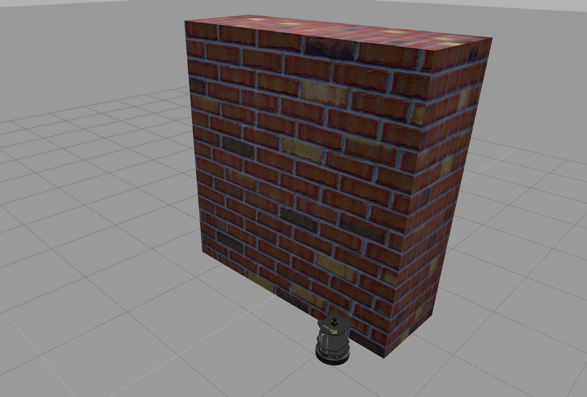

# Kobuki-Avoiding-Wall

A simple implementation of a Kobuki robot which using its laser scan, avoids a wall in front of it in a ROS environment.

## Testing the code:

* Download the files.
* Create a catkin package and put the folder contents into it. 
* catkin_make 
* Launch the topics_mini_project.launch file.
* Stop the robot after it has gone past the wall using rostopic pub.

## Images

 

 

